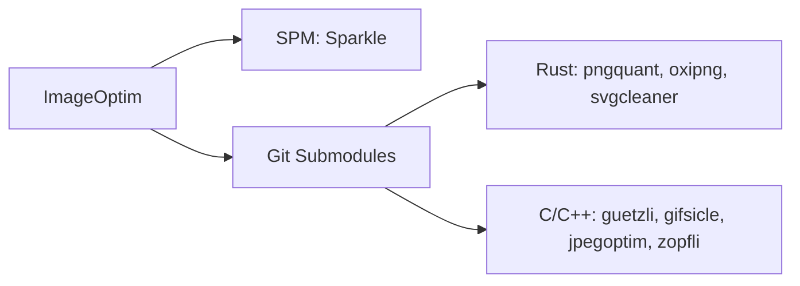

# ImageOptim SPM 迁移可行性分析

## 项目概述

ImageOptim 是一个 macOS 图像优化应用，使用 Objective-C 开发。当前项目通过 **Git 子模块** 管理 9 个外部依赖，并通过 Xcode 项目引用这些子模块的 Xcode 工程进行构建。

## 当前依赖分析

| 依赖 | 语言/构建系统 | SPM 支持 | 用途 | 迁移可行性 |
|------|--------------|----------|------|------------|
| **Sparkle** | Objective-C/Xcode | ✅ 原生支持 | 应用自动更新框架 | **高** - 可直接迁移 |
| **pngquant** | Rust/Cargo | ❌ 不支持 | PNG 量化压缩 | **无** - Rust 项目 |
| **oxipng** | Rust/Cargo | ❌ 不支持 | PNG 无损优化 | **无** - Rust 项目 |
| **svgcleaner** | Rust/Cargo | ❌ 不支持 | SVG 清理优化 | **无** - Rust 项目 |
| **guetzli** | C++/Bazel | ❌ 不支持 | JPEG 压缩 | **低** - 需要创建 SPM 包装 |
| **gifsicle** | C/autoconf | ❌ 不支持 | GIF 优化 | **低** - 需要创建 SPM 包装 |
| **jpegoptim** | C/CMake | ❌ 不支持 | JPEG 优化 | **低** - 需要创建 SPM 包装 |
| **libjpeg (mozjpeg)** | C/CMake | ❌ 不支持 | JPEG 库 | **低** - 需要创建 SPM 包装 |
| **zopfli** | C++/CMake | ❌ 不支持 | PNG/Zlib 压缩 | **低** - 需要创建 SPM 包装 |

## 详细分析

### 1. Sparkle - 可迁移 ✅

Sparkle 是唯一原生支持 SPM 的依赖：

- 官方提供 [`Package.swift`](Sparkle/Package.swift)
- 可通过 Xcode 的 "Add Package Dependency" 直接添加
- 迁移步骤：
  1. 移除 Sparkle Git 子模块
  2. 在 Xcode 中添加 `https://github.com/sparkle-project/Sparkle` 包
  3. 更新代码中的 import 语句（如有变化）

### 2. Rust 项目 - 不可迁移 ❌

以下依赖是 Rust 项目，**SPM 无法直接管理**：

- **pngquant** - 使用 Cargo 构建系统
- **oxipng** - 使用 Cargo 构建系统  
- **svgcleaner** - 使用 Cargo 构建系统

**替代方案**：
- 保持当前 Git 子模块方式
- 或使用 Homebrew/pre-built 二进制文件
- 或创建自定义构建脚本下载预编译二进制

### 3. C/C++ 项目 - 理论可迁移但工作量大 ⚠️

以下 C/C++ 项目理论上可以通过创建 `Package.swift` 来支持 SPM：

- **guetzli** - Google 的 JPEG 压缩工具
- **gifsicle** - GIF 优化工具
- **jpegoptim** - JPEG 优化工具
- **libjpeg (mozjpeg)** - JPEG 库
- **zopfli** - Google 的压缩库

**迁移挑战**：
1. 需要为每个项目创建自定义 `Package.swift`
2. 需要处理平台特定的编译选项
3. 需要处理依赖关系（如 libpng、zlib）
4. 上游项目不维护 SPM 支持，需要自行维护分支

## 推荐方案

### 方案 A：部分迁移（推荐）

仅将 **Sparkle** 迁移到 SPM，其他依赖保持现状：

**优点**：
- 减少一个子模块的管理复杂度
- Sparkle 更新更方便
- 风险最低

### 方案 B：混合管理

为 C/C++ 项目创建 SPM 包装，Rust 项目保持子模块：

**工作量估算**：
- 需要为 5 个 C/C++ 项目创建和维护 `Package.swift`
- 需要处理跨平台编译问题
- 需要维护 fork 或提交 PR 到上游

### 方案 C：完全保持现状

保持所有 Git 子模块，仅修复当前的子模块问题。

## 结论

**SPM 迁移的可行性有限**：

1. **只有 Sparkle 可以直接迁移到 SPM**
2. **Rust 项目（pngquant、oxipng、svgcleaner）无法使用 SPM 管理**
3. **C/C++ 项目需要大量额外工作才能支持 SPM**

建议采用 **方案 A**：仅迁移 Sparkle 到 SPM，其他依赖继续使用 Git 子模块管理。

## 下一步

请确认您希望采用哪种方案：

1. **方案 A**：仅迁移 Sparkle
2. **方案 B**：尝试为 C/C++ 项目创建 SPM 支持
3. **方案 C**：保持现状
4. **其他需求**：请说明您的具体目标
